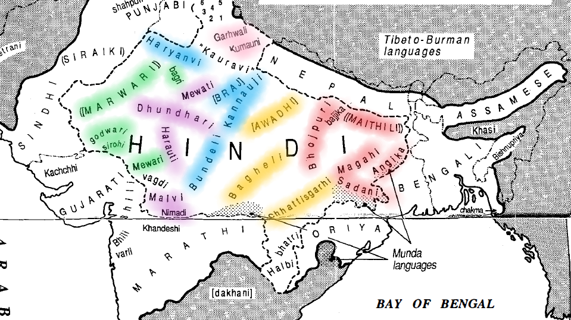

Hindi
=====
.. contents::
    :local:

Hindi is the most common language in India, as shown in `Languages of India`_. It is also referred to as "Language of India". Despite that fact, it is not the national language of India - being strongly opposed by the people that do not speak Hindu, the Indian constitution did not list any language as the national language. It is also spoken in other countries, like Fiji. However, there is an ongoing plan of promoting the progressive use of Hindu, and reducing the use of English in official purposes. Yet due to opposing opinions, no restriction is imposed on using English. :cite:`india-con`

Dialects :cite:`masica1993indo`
-------------------------------
There exist regional languages of the Hindi area, or "Hindi dialects". Some of them are closely related to standard Hindi, some more distant. Vernacular Hindi could be roughly classified as *Eastern Hindi* and *Western Hindi*. *Western Hindi* consists of *Braj*, *Kannauji* and *Bangaru*, while *Eastern Hindi* consists of *Awadhi*, *Bagheli*, and *Chhattisgarhi*. Here's a list of regions these languages are spoken:

**Western Hindi**:

- *Braj*: An area centering Mathura, southeast of Delhi, southwest to Bareilly. 
- *Bundeli*: Closely related to *Braj*. 
- *Kannauji*: From Etawah and Kanpur up to Pilibhit 
- *Bangaru*(also called *Haryanvi*): Haryana State and rural parts of Delhi 

**Eastern Hindi**

- *Awadhi*: East-central Uttar Pradesh, north and south of Lucknow. 
- *Bagheli*: A variety of *Awadhi*, Madhya Pradesh from Rewa to Jabalpur and Mandla 
- *Chhattisgarhi*: Southeast on the border of Orissa 

Here's a map from *The Indo-Aryan Languages*. Each language is marked with color, by the group of language they belong to. Blue parts are Western Hindi, and yellow parts are eastern Hindi. Other colored languages are not Hindi, but mentioned elsewhere and share the map.

Devanagari Script
----------------
Hindi is written in Devanagari script, a very complicated form of writing. Unlike most languages that have distinct characters, Devanagari symbols represent phonetic elements and are often written in compounds. There're lots of variations for one single sound when diacritic is added. 

Devanagari script is a branch of Brahmi Script. More on Devanagari Script and its history, relate to `Brahmi Script`_.

Literature:cite:`keay1920hist`
--------------------------------
Literature in Hindi can be divided into several periods:

Early Bardic Chronicles (1150-1400)
-----------------------------------
These are the earliest poetry written in Hindi. Developed during the conflict between Rajput clans and invading Muhammadan powers, these poets sing the bravery of soldiers. These bards must have been using local language *Prakit* in the beginning, but then developed their modern vernacular.

Chand Bardai
^^^^^^^^^^^^
Composer of *Prithviraj Raso*, in 69 books and over 100,000 verses. Consists of the history of that time and life of his patron, mixed with legends and fictions. Therefore some of its content contradict with other works of the same period.
The language used in this work is a transitional form, in which some strange expressions have been obsolete for a long time.
He himself was born in 1159 and died in 1192. He was the ruler of Ajmer and Delhi. He was captured during the second battle of Tarain then slained.

Jagnayak
^^^^^^^^
None of his works survived, except some verses in Mahoba Khand. This poem has been handed down only by oral tradition, therefore it existed in many recensions, differing in language and subject matter.
He was a contemporary of Chand Bardai.

Sarang Dhar
^^^^^^^^^^^
Author of *Hammir Rasa* and *Hammir Kavya*, chronicles of the royal house of Ranthambhor.
It's a famous story about Hammir fighting against the emperor Alauddin.
He is said to be the descendant of Chand Bardai.

Early *Bhakti* Poets (1400-1550)
--------------------------------
.. note::
    This is exactly the devotional poets we read in the lectures. 

Tulsi Das and the Rama Cult (1550-1800)
---------------------------------------
Tulsi Das is the author of Ramayana, the legendary literature that is well-known around the world.
Originally named Rambola, he took the name of Tulsi Das after becoming a devotee. He lived a normal, insignificant life apart from the legend. Many legends are told about him, but none of them is reliable. *Nabha Das*, the author of the *Bhaktamaldy* is said to have been his friend, and *Sur Das* is also supposed to have visited him.
The language he used was Awadhi, a dialect that belongs to Eastern Hindi. However, he also incorporated lots of words from other dialects, especially *Braj*.

The Modern Period (1800 - )
----------------------------
At the beginning of the 18th century, India got influenced by the western diaspora. The East India Company took over the government of vast areas of India. The introduction of printing facilities (presses) helped the distribution of literature, and technologies changed the life of local people in many ways. The Company encouraged vernacular Hindi literature.

Munshi Premchand
~~~~~~~~~~~~~~~~
His real name is Dhanpat Rai Shrivastava. He is one of the most celebrated writers of India. Before him, Hindi literature was mostly about fairy tales, epics, entertainment and religion. He is the pioneer of bringing realism to Hindi prose literature.

.. _Languages of India: ../lang-cntry/india.html
.. _Brahmi Script: ../scripts/brahmi.html#devanagari

.. bibliography:: ref-hindu.bib