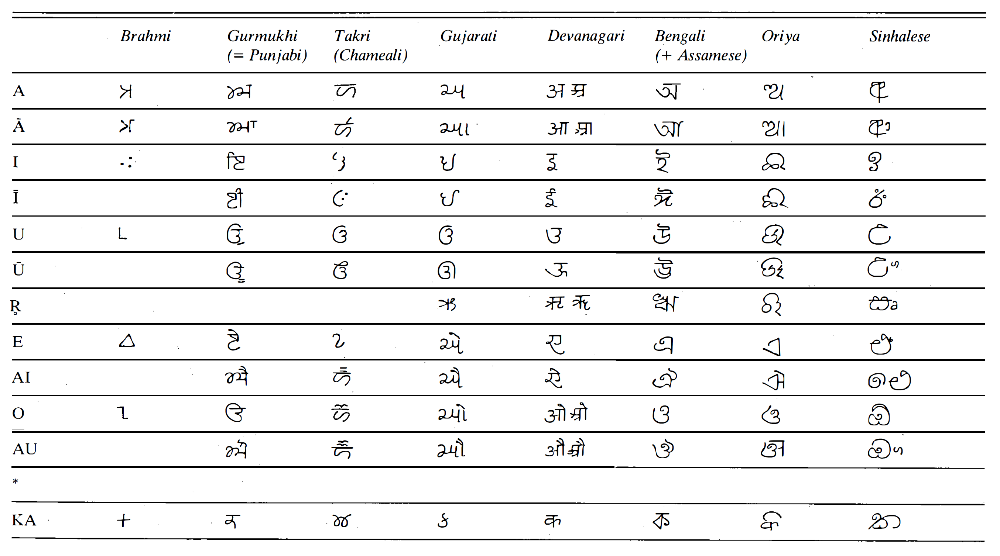
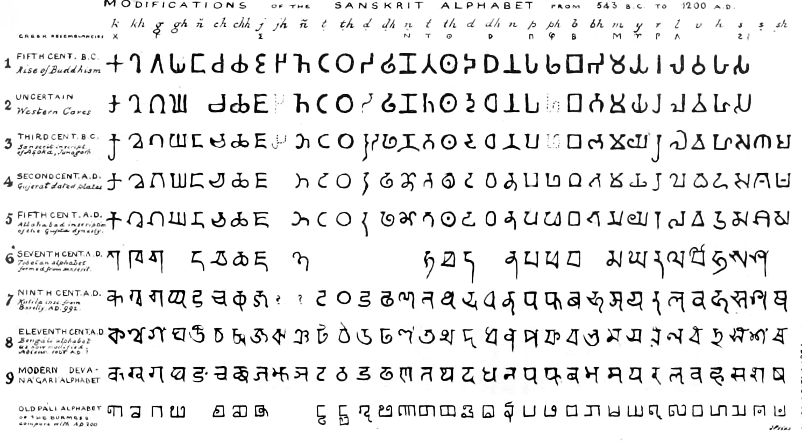

Brahmi Scripts
==============
There're dozens of form of writing in the Indian area, and many of them have a common root to the Brahmi script, which could be dated back to the third century B.C.

.. contents::
    :local:

History
-------
The origin of Brahmi script is controversial. Most Western Scholars consider it a derivation of North Semitic, while a few think it's from South Semitic or a progenitor of both. However, both would agree that this script got again refined and improved a lot in India, especially on phonetics which contributed a lot to the rhyme of the verses.

At the beginning, Brahmi was being used for Prakrit, then being used by Sanskrit about four centuries later. At first, it is only being used for administrative, literary and scientific purposes. This also helped settling those oral sacred texts on writing.

Evolution and Diversification
-----------------------------
Brahmi went through some serious diversification in India, eventually turning into several mutually intelligible forms. This diversification is notable because no other scripts undergo such dramatic change during the same time period. 

Such dramatic change might be related to politics. The poltical unity India attained under the Mauryas did not approach again for a whole nineteen hundred years. Therefore, no one centralized writing word or one sacred written text was maintained. The Brahmans themselves are also regionally divided. When they maintain Sanskrit language, they wrote it in various regional scripts. 

Its detailed evolution path is very complicated. So here's a simplified tree structure, containing several branches we care about most. Note that this diagram is largely simplified. Some intermediate scripts are neglected. Shown as direct ancestor in this graph does not mean they're direct ancestors: there might be several generations between them.

.. graphviz::

    digraph{
        "Brahmi" -> "Southern Brahmi"
        "Brahmi" -> "Northern Brahmi"
        "Northern Brahmi" -> "Gupta"
        "Gupta" -> "Sharda"
        "Sharda" -> "Early Nagari"
        "Sharda" -> "Proto-Bengali"
        "Gupta" -> "Tibetan"
        "Early Nagari" -> "Modern Devanagari"
        "Early Nagari" -> "Kaithi"
        "Early Nagari" -> "Gujarati"
        "Early Nagari" -> "Modi"
        "Proto-Bengali" -> "Modern Bengali"
        "Proto-Bengali" -> "Maithili"
        "Southern Brahmi" -> "Grantha"
        "Southern Brahmi" -> "Malayalam"
        "Southern Brahmi" -> "Tamil"
    }

Here's a graph comparing Brahmi with several modern scripts derivated from it.

    Excerpt of symbol table for several scripts using Brahmi-derived scripts. Adopted from :cite:`masica1993indo`

It is obvious that the evolved scripts looked nothing like the original Brahmi, and they're also very different from each other. They have been evolving individually for a long time, leading to very different use of drawing elements. Also, all the derived scripts have added symbols to represent additional dicritics or new sounds compared to Brahmi.
Something not represented in this extracted page is that the derived scripts also have a difference in symbols. Some scripts have symbols that do not exist in other scripts.

Devanagari
----------
Devanagari is a composition of "deva" and "naragi". "Nagari" means "city" or "metropolitan", which is the original name of the language. "deva" means "divine". There's also another branch of Nagari, called Nandinagari. The Devanagari is being used for not only Hindi, but also Sanskrit, Marathi, Nepali, Maithili, Sindhi, etc. 

This picture shows how Devangari for Sanskrit evolved from Brahmi over time.

    Evolution of Brahmi into Devanagari. By James Prinsep, 1838. :cite:`james1838`

.. bibliography:: brahmi.bib