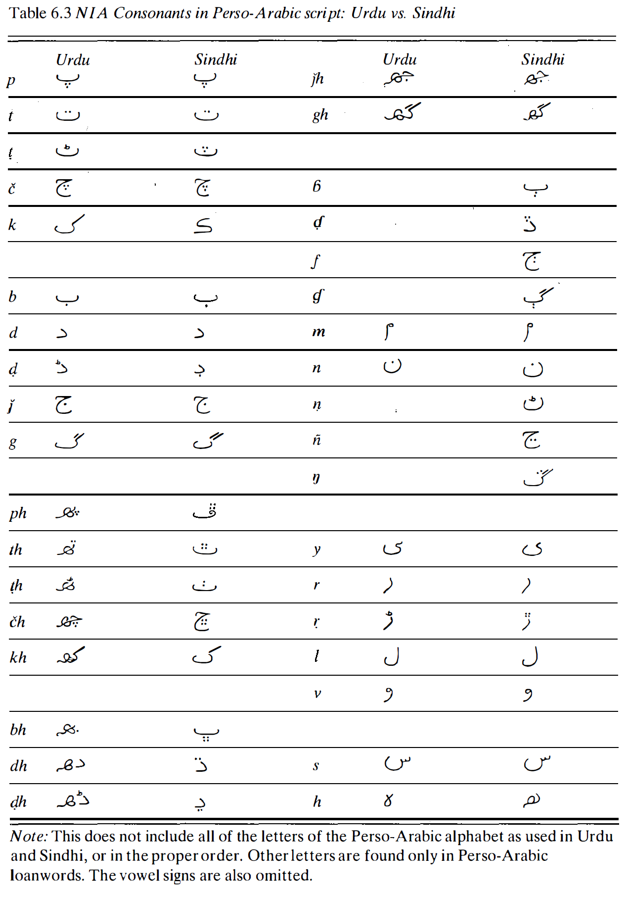

Perso-Arabic Scripts
====================
Perso-Arabic scripts are not designed for Indo-Aryan languages. To fit Indo-Aryan languages, dicritics is added to the script. Its evolution to fit the modern languages a much simpler and easily done than with `Brahmi`_. The redundant symbols for Indo-Aryan family are preserved to represent foreign lexicon from Arabic. 

Urdu and Sindhi employs this script, with only minor differences on several elements.

    Consonants in Perso-Arabic script across Urdu and Sindhi. From *The Indo-Aryan Languages* :cite:`masica1993indo`

There's also the Maldivian script, called Tana or Thanna, that looks similar to Arabic script. It employed certain Arabic diatrics and numerals, and it's also written from right to left. However, this script is a completely original invention, not a modification of any Arabic script.

.. _Brahmi : ./brahmi.rst

.. bibliography:: perso-arabic.bib